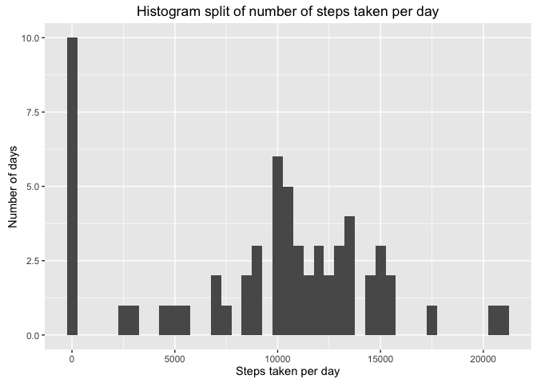
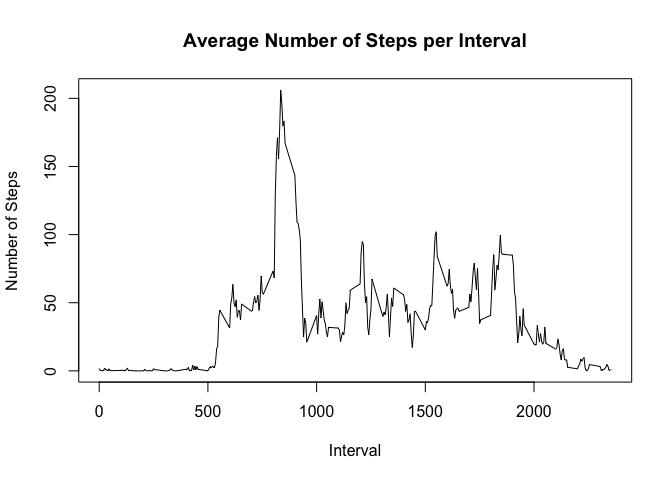
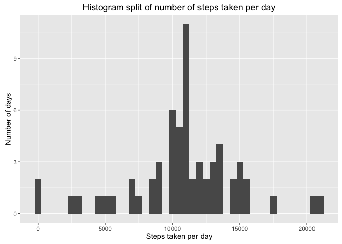
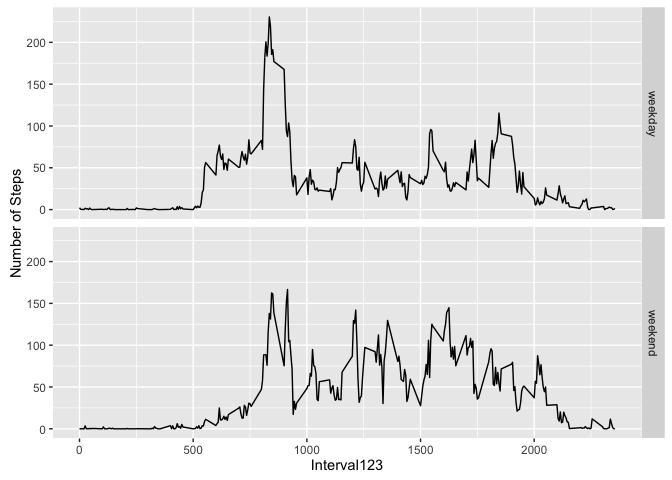

# Reproducible Research: Peer Assessment 1

This document describes the analysis done on personal data collected from a personal activity
monitoring device. This device collects data at 5 minute intervals through out the day. The data consists of two months of data from an anonymous individual collected during the months of October and November, 2012 and include the number of steps taken in 5 minute intervals each day.

The data for this assignment can be downloaded from the course web site:

Dataset: [https://d396qusza40orc.cloudfront.net/repdata%2Fdata%2Factivity.zip](Activity monitoring data) [52K]

The variables included in this dataset are:

 * steps: Number of steps taking in a 5-minute interval (missing values are coded as 𝙽𝙰)
 * date: The date on which the measurement was taken in YYYY-MM-DD format
 * interval: Identifier for the 5-minute interval in which measurement was taken

The dataset is stored in a comma-separated-value (CSV) file and there are a total of 17,568 observations in this dataset.


```r
library(dplyr)
```

```
## 
## Attaching package: 'dplyr'
```

```
## The following objects are masked from 'package:stats':
## 
##     filter, lag
```

```
## The following objects are masked from 'package:base':
## 
##     intersect, setdiff, setequal, union
```

```r
library(chron)
library(ggplot2)
```

```
## Warning: package 'ggplot2' was built under R version 3.2.4
```

## Loading and preprocessing the data

Unzip the file `activity.zip` into `activity.csv` and load the data from it into `csv` format.


```r
unzip(zipfile="activity.zip")
activity_data <- tbl_df(read.csv("activity.csv", header = TRUE))
```

## What is mean total number of steps taken per day?

### Calculate the total number of steps taken per day

```r
by_day <- aggregate(activity_data$steps, by=list(activity_data$date), sum, na.rm=TRUE)
names(by_day) <- c("Date", "Number.of.Steps")
```

### Make a histogram of the Total number of steps taken each day

```r
qplot(by_day$Number.of.Steps, xlab="Steps taken per day", binwidth=500,
      main="Histogram split of number of steps taken per day", ylab="Number of days")
```



### Calculate and report the mean and median of the total number of steps taken per day

```r
summary(by_day$Number.of.Steps)
```

```
##    Min. 1st Qu.  Median    Mean 3rd Qu.    Max. 
##       0    6778   10400    9354   12810   21190
```

## What is the average daily activity pattern?


```r
by_interval <- aggregate(activity_data$steps, by=list(activity_data$interval), mean, na.rm=TRUE)
names(by_interval) <- c("Interval", "Number.of.Steps")
```

### Time series plot

```r
plot(by_interval$Interval, by_interval$Number.of.Steps, type="l",
     xlab="Interval", ylab="Number of Steps",
     main="Average Number of Steps per Interval")
```



### Five minute interval with the largest number of steps

```r
by_interval[order(by_interval$Number.of.Steps, decreasing = TRUE),]$Interval[[1]]
```

```
## [1] 835
```

## Imputing missing values

### Total number of missing values

```r
summary(activity_data$steps)[["NA's"]]
```

```
## [1] 2304
```

### Fill up missing values
Missing values for an interval will be filled as the mean of the number of steps taken for that
particular interval

```r
activity_data_filled <- activity_data
for(interval in by_interval$Interval) {
    activity_data_filled$steps[activity_data$interval == interval & is.na(activity_data_filled$steps)] <-
        by_interval[by_interval$Interval == interval,]$Number.of.Steps
}
```

### Make a histogram with the new dataset

```r
by_day_filled <- aggregate(activity_data_filled$steps, by=list(activity_data_filled$date), sum, na.rm=FALSE)
names(by_day_filled) <- c("Date", "Number.of.Steps")
qplot(by_day_filled$Number.of.Steps, xlab="Steps taken per day", binwidth=500,
      main="Histogram split of number of steps taken per day", ylab="Number of days")
```



```r
summary(by_day_filled$Number.of.Steps)
```

```
##    Min. 1st Qu.  Median    Mean 3rd Qu.    Max. 
##      41    9819   10770   10770   12810   21190
```

The mean and median values have changed as compared to the earlier verison where NAs were present. The reason
why these values have changed is because we have filled the NA values with the mean of the particular interval
and not the global mean. Similarly, we see that the values in the first and the second quadrant has also changed
but not in the third and fourth quadrant because the values that have been modified are in the earlier quadrants.

## Are there differences in activity patterns between weekdays and weekends?

### Create a new column weekend

```r
activity_data_filled["weekend"] <- is.weekend(activity_data_filled$date)
```

### Time series plot
A time series plot needs to be generated for the average number of steps taken per five minute
interval separately for weekdays and weekends. To do so, the following steps are taken:

Separate out the weekend and weekday data.

```r
weekend_activity_data <- activity_data_filled[activity_data_filled$weekend,]
weekday_activity_data <- activity_data_filled[activity_data_filled$weekend == FALSE,]
```

Calculate average number of steps per interval for the two sets of data

```r
weekend_aggregate <- aggregate(weekend_activity_data$steps, by=list(weekend_activity_data$interval), mean)
weekday_aggregate <- aggregate(weekday_activity_data$steps, by=list(weekday_activity_data$interval), mean)

names(weekday_aggregate) <- c("Interval", "steps")
names(weekend_aggregate) <- c("Interval", "steps")
```

Join the two datasets to create a final dataset with Interval, Steps and Day type (weekend/weekday)

```r
weekday_aggregate["weekend_weekday"] <- "weekday"
weekend_aggregate["weekend_weekday"] <- "weekend"
final_aggregate <- bind_rows(weekday_aggregate, weekend_aggregate)
```

### Plot the weekend and weekday line graphs

```r
ggplot(final_aggregate, aes(Interval, steps)) + geom_line() + facet_grid(weekend_weekday ~ .) + xlab("Interval123") + ylab("Number of Steps")
```


